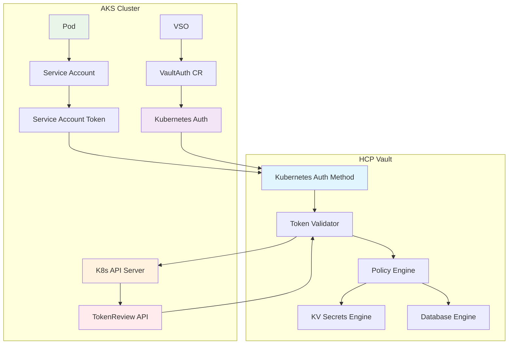
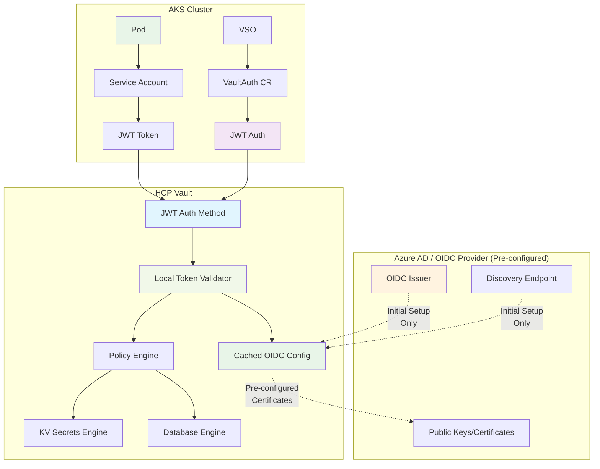
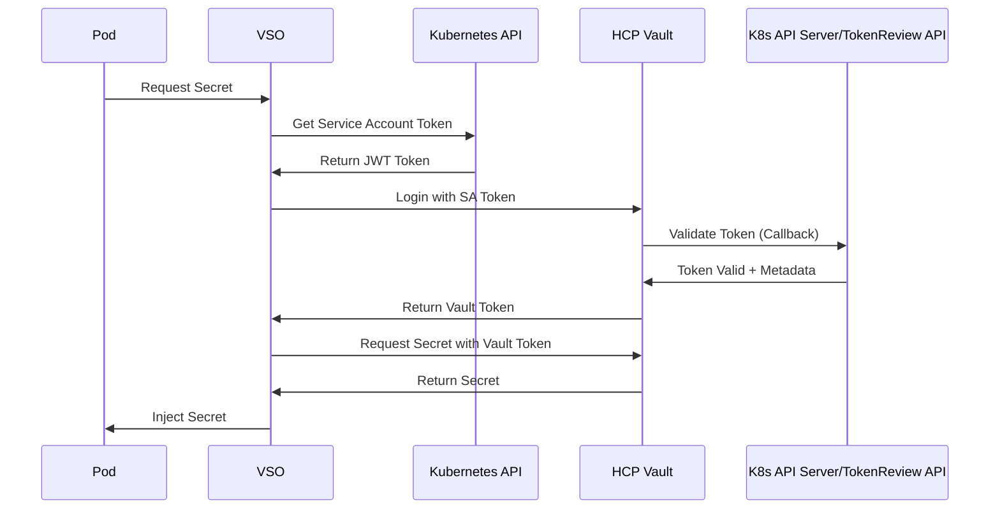
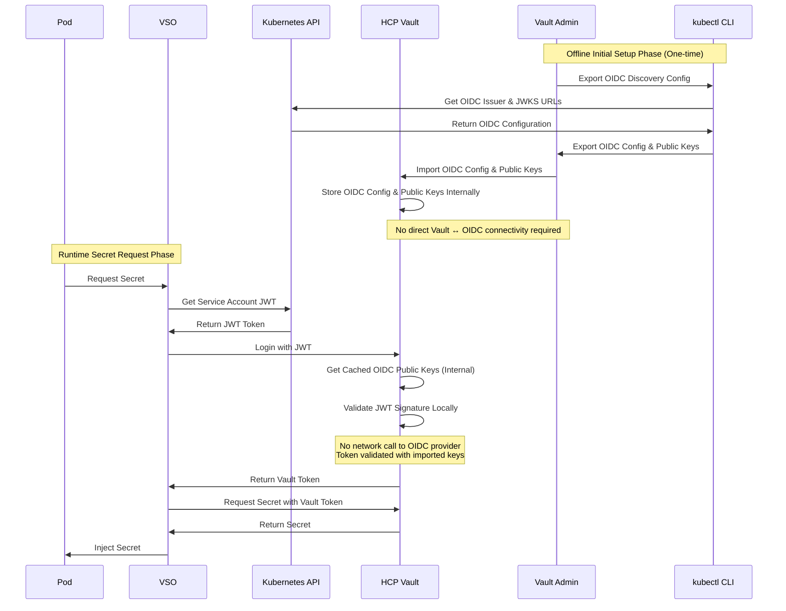

# Kubernetes Integration with Vault using Vault Secrets Operator (VSO)

## Overview

This guide demonstrates how to integrate Kubernetes with HashiCorp Vault using the Vault Secrets Operator (VSO) with two different authentication methods:

1. **Kubernetes Auth Method** - Direct service account token authentication
2. **OIDC/JWT Auth Method** - JSON Web Token-based authentication

Both methods enable secure, automated secret retrieval from Vault without storing long-lived credentials in your Kubernetes cluster.

## Architecture Comparison

### Method 1: Kubernetes Auth Method



### Method 2: OIDC/JWT Auth Method



## Authentication Flow Comparison

### Key Differences in Token Validation

#### Kubernetes Auth Method:
- **Live Validation**: HCP Vault makes a callback to the Kubernetes API Server's TokenReview API for every authentication request
- **Network Dependency**: Requires continuous network connectivity between Vault and Kubernetes API Server
- **Real-time Verification**: Each token is validated in real-time against the Kubernetes cluster

#### OIDC/JWT Auth Method:
- **Offline Configuration**: Export OIDC config using kubectl, then import into Vault (no direct connectivity required)
- **Local Validation**: Vault validates JWT tokens locally using imported certificates
- **Air-Gapped Support**: Suitable for environments where Vault cannot reach external OIDC endpoints
- **Cryptographic Verification**: Token signatures are verified using imported public keys

### Kubernetes Auth Flow



### OIDC/JWT Auth Flow



## Prerequisites

### Common Prerequisites

- **Kubernetes Cluster** (AKS, EKS, GKE, or on-premises) with version 1.21+
- **Vault Secrets Operator** installed in the cluster
- **HCP Vault** or self-managed Vault cluster
- **kubectl** configured to access your cluster
- **vault** CLI tool for configuration

### Method-Specific Prerequisites

#### For Kubernetes Auth Method:
- Vault must have network connectivity to Kubernetes API server
- Service account token reviewer permissions

#### For OIDC/JWT Auth Method:
- OIDC issuer enabled on your Kubernetes cluster
- Public OIDC discovery endpoint accessible by Vault

## Method 1: Kubernetes Auth Method

### Step 1: Install Vault Secrets Operator

```bash
# Add HashiCorp Helm repository
helm repo add hashicorp https://helm.releases.hashicorp.com
helm repo update

# Install VSO
helm install vault-secrets-operator hashicorp/vault-secrets-operator \
  --namespace vault-secrets-operator-system \
  --create-namespace \
  --set defaultVaultConnection.enabled=true \
  --set defaultVaultConnection.address="https://your-vault-cluster.vault.example.com:8200"
```

### Step 2: Configure Kubernetes Auth in Vault

```bash
# Set Vault environment
export VAULT_ADDR="https://your-vault-cluster.vault.example.com:8200"
export VAULT_TOKEN="your-admin-token"

# Enable Kubernetes auth method
vault auth enable kubernetes

# Get Kubernetes API server details
K8S_HOST=$(kubectl config view --raw --minify --flatten -o jsonpath='{.clusters[].cluster.server}')
K8S_CA_CERT=$(kubectl config view --raw --minify --flatten -o jsonpath='{.clusters[].cluster.certificate-authority-data}' | base64 -d)

# Configure Kubernetes auth
vault write auth/kubernetes/config \
    token_reviewer_jwt="$(kubectl create token vault-secrets-operator -n default --duration=8760h)" \
    kubernetes_host="$K8S_HOST" \
    kubernetes_ca_cert="$K8S_CA_CERT"
```

### Step 3: Create Vault Policy

```bash
# Create policy for application secrets
vault policy write app-policy - <<EOF
# KV secrets access
path "secret/data/myapp/*" {
  capabilities = ["read"]
}

# Database credentials access
path "database/creds/myapp-db-role" {
  capabilities = ["read"]
}

# Token renewal
path "auth/token/renew-self" {
  capabilities = ["update"]
}
EOF
```

### Step 4: Create Kubernetes Auth Role

```bash
# Create role binding service accounts to policy
vault write auth/kubernetes/role/myapp-role \
    bound_service_account_names="vault-secrets-operator" \
    bound_service_account_namespaces="default,myapp" \
    policies="app-policy" \
    ttl=24h
```

### Step 5: Deploy Service Account and VSO Configuration

```yaml
# service-account.yaml
apiVersion: v1
kind: ServiceAccount
metadata:
  namespace: myapp
  name: vault-secrets-operator
automountServiceAccountToken: true
---
apiVersion: rbac.authorization.k8s.io/v1
kind: ClusterRoleBinding
metadata:
  name: vault-secrets-operator-myapp
roleRef:
  apiGroup: rbac.authorization.k8s.io
  kind: ClusterRole
  name: system:auth-delegator
subjects:
- kind: ServiceAccount
  name: vault-secrets-operator
  namespace: myapp
---
apiVersion: secrets.hashicorp.com/v1beta1
kind: VaultConnection
metadata:
  namespace: myapp
  name: vault-connection
spec:
  address: "https://your-vault-cluster.vault.example.com:8200"
  skipTLSVerify: false
---
apiVersion: secrets.hashicorp.com/v1beta1
kind: VaultAuth
metadata:
  namespace: myapp
  name: vault-auth
spec:
  method: kubernetes
  mount: kubernetes
  kubernetes:
    role: myapp-role
    serviceAccount: vault-secrets-operator
---
apiVersion: secrets.hashicorp.com/v1beta1
kind: VaultStaticSecret
metadata:
  namespace: myapp
  name: app-secrets
spec:
  type: kv-v2
  mount: secret
  path: myapp/config
  destination:
    name: app-secrets
    create: true
  refreshAfter: 30s
  vaultAuthRef: vault-auth
```

## Method 2: OIDC/JWT Auth Method

### Step 1: Extract OIDC Configuration from Kubernetes

#### Method 1: Offline Configuration (Recommended for Air-Gapped Environments)

```bash
# Export OIDC configuration using kubectl (no direct Vault connectivity needed)

# 1. Get OIDC issuer URL
OIDC_ISSUER=$(kubectl get --raw /.well-known/openid_configuration | jq -r '.issuer')
echo "OIDC Issuer: $OIDC_ISSUER"

# 2. Export OIDC discovery configuration
kubectl get --raw /.well-known/openid_configuration > oidc-discovery.json

# 3. Get JWKS (JSON Web Key Set) - public keys for token validation
JWKS_URI=$(cat oidc-discovery.json | jq -r '.jwks_uri')
curl -s "$JWKS_URI" > jwks.json

# 4. Extract individual components for Vault configuration
echo "OIDC Discovery Configuration:"
cat oidc-discovery.json | jq .

echo "\nJWKS Public Keys:"
cat jwks.json | jq .
```

#### Method 2: Direct Configuration (Requires Vault → OIDC Connectivity)

For AKS clusters:
```bash
# Get OIDC issuer URL
OIDC_ISSUER=$(az aks show -g myResourceGroup -n myAKSCluster --query 'oidcIssuerProfile.issuerURL' -o tsv)
echo "OIDC Issuer: $OIDC_ISSUER"

# Verify OIDC discovery endpoint
curl -s "$OIDC_ISSUER/.well-known/openid_configuration" | jq .
```

For other Kubernetes distributions:
```bash
# Check if OIDC issuer is configured
kubectl get --raw /.well-known/openid_configuration | jq .

# Or check from cluster info
kubectl cluster-info dump | grep -i oidc
```

### Step 2: Configure JWT Auth in Vault (Offline Method)

#### Import OIDC Configuration into Vault

```bash
# Set Vault environment
export VAULT_ADDR="https://your-vault-cluster.vault.example.com:8200"
export VAULT_TOKEN="your-admin-token"

# Enable JWT auth method
vault auth enable jwt

# Method 1: Manual configuration with exported keys
# Extract required values from exported files
OIDC_ISSUER=$(cat oidc-discovery.json | jq -r '.issuer')
JWKS_URI=$(cat oidc-discovery.json | jq -r '.jwks_uri')

# Configure JWT auth with manual JWKS
vault write auth/jwt/config \
    bound_issuer="$OIDC_ISSUER" \
    jwks_url="$JWKS_URI"

# Method 2: Direct JWKS import (for air-gapped environments)
# Convert JWKS to PEM format and configure
# Note: This requires additional tooling to convert JWKS to PEM

# Method 3: Hybrid approach (Recommended)
# Use OIDC discovery but with pre-validated URLs
vault write auth/jwt/config \
    oidc_discovery_url="$OIDC_ISSUER" \
    bound_issuer="$OIDC_ISSUER" \
    oidc_discovery_ca_pem="$(cat k8s-ca.crt)"  # If using custom CA
```

#### Alternative: Direct Configuration (Original Method)

```bash
# Enable JWT auth method
vault auth enable jwt

# Configure JWT auth with OIDC discovery
vault write auth/jwt/config \
    oidc_discovery_url="$OIDC_ISSUER" \
    bound_issuer="$OIDC_ISSUER"

# Alternative: Manual configuration without OIDC discovery
vault write auth/jwt/config \
    jwks_url="$OIDC_ISSUER/openid/v1/jwks" \
    bound_issuer="$OIDC_ISSUER"
```

### Step 3: Create JWT Auth Role

```bash
# Create JWT role for Kubernetes service accounts
vault write auth/jwt/role/myapp-jwt-role \
    role_type="jwt" \
    bound_audiences="https://kubernetes.default.svc.cluster.local" \
    bound_subject="system:serviceaccount:myapp:vault-secrets-operator" \
    bound_claims='{"kubernetes.io/serviceaccount/namespace":"myapp"}' \
    user_claim="sub" \
    policies="app-policy" \
    ttl="1h" \
    max_ttl="24h"
```

### Step 4: Deploy Service Account and VSO Configuration for JWT

```yaml
# jwt-service-account.yaml
apiVersion: v1
kind: ServiceAccount
metadata:
  namespace: myapp
  name: vault-secrets-operator
  annotations:
    # For Azure Workload Identity (if using)
    azure.workload.identity/client-id: "your-client-id"
automountServiceAccountToken: true
---
apiVersion: secrets.hashicorp.com/v1beta1
kind: VaultConnection
metadata:
  namespace: myapp
  name: vault-connection
spec:
  address: "https://your-vault-cluster.vault.example.com:8200"
  skipTLSVerify: false
---
apiVersion: secrets.hashicorp.com/v1beta1
kind: VaultAuth
metadata:
  namespace: myapp
  name: vault-auth-jwt
spec:
  method: jwt
  mount: jwt
  jwt:
    role: myapp-jwt-role
    serviceAccount: vault-secrets-operator
    audiences:
      - "https://kubernetes.default.svc.cluster.local"
---
apiVersion: secrets.hashicorp.com/v1beta1
kind: VaultStaticSecret
metadata:
  namespace: myapp
  name: app-secrets-jwt
spec:
  type: kv-v2
  mount: secret
  path: myapp/config
  destination:
    name: app-secrets-jwt
    create: true
  refreshAfter: 30s
  vaultAuthRef: vault-auth-jwt
```

## Application Integration Examples

### Static Secrets Integration

```yaml
# application-deployment.yaml
apiVersion: apps/v1
kind: Deployment
metadata:
  namespace: myapp
  name: my-application
spec:
  replicas: 2
  selector:
    matchLabels:
      app: my-application
  template:
    metadata:
      labels:
        app: my-application
    spec:
      serviceAccountName: vault-secrets-operator
      containers:
      - name: app
        image: my-app:latest
        env:
        # Using Kubernetes Auth method secrets
        - name: DATABASE_URL
          valueFrom:
            secretKeyRef:
              name: app-secrets
              key: database_url
        - name: API_KEY
          valueFrom:
            secretKeyRef:
              name: app-secrets
              key: api_key
        # Using JWT Auth method secrets
        - name: JWT_SECRET
          valueFrom:
            secretKeyRef:
              name: app-secrets-jwt
              key: jwt_secret
        ports:
        - containerPort: 8080
```

### Dynamic Secrets Integration

```yaml
# dynamic-secrets.yaml
apiVersion: secrets.hashicorp.com/v1beta1
kind: VaultDynamicSecret
metadata:
  namespace: myapp
  name: database-credentials
spec:
  mount: database
  path: creds/myapp-db-role
  destination:
    name: database-credentials
    create: true
    transformation:
      templates:
        connection_string: |
          postgresql://{{ .Secrets.username }}:{{ .Secrets.password }}@postgres:5432/myapp
  refreshAfter: 300s  # 5 minutes
  renewalPercent: 67
  vaultAuthRef: vault-auth  # or vault-auth-jwt for JWT method
---
apiVersion: apps/v1
kind: Deployment
metadata:
  namespace: myapp
  name: app-with-dynamic-secrets
spec:
  replicas: 1
  selector:
    matchLabels:
      app: app-with-dynamic-secrets
  template:
    metadata:
      labels:
        app: app-with-dynamic-secrets
    spec:
      serviceAccountName: vault-secrets-operator
      containers:
      - name: app
        image: my-app:latest
        env:
        - name: DB_CONNECTION_STRING
          valueFrom:
            secretKeyRef:
              name: database-credentials
              key: connection_string
        - name: DB_USERNAME
          valueFrom:
            secretKeyRef:
              name: database-credentials
              key: username
        - name: DB_PASSWORD
          valueFrom:
            secretKeyRef:
              name: database-credentials
              key: password
```

## Comparison: Kubernetes Auth vs OIDC/JWT

| Aspect | Kubernetes Auth | OIDC/JWT Auth |
|--------|----------------|----------------|
| **Network Connectivity** | Vault → K8s API required (callback) | No connectivity needed (offline config possible) |
| **Token Validation** | K8s API Server/TokenReview API (live callback) | Local validation with imported/cached certificates |
| **Setup Complexity** | Moderate | Higher (OIDC configuration) |
| **Configuration Method** | Direct Vault → K8s connection | kubectl export → Vault import (offline) |
| **Security** | Good (live validation) | Excellent (cryptographic validation) |
| **Scalability** | Limited by API calls to K8s | Highly scalable (no external calls) |
| **Offline Validation** | No (requires K8s API callback) | Yes (with imported certificates) |
| **Air-Gapped Support** | No (requires network connectivity) | Yes (offline configuration) |
| **Cloud Native** | Traditional approach | Modern, cloud-native approach |
| **Multi-cluster** | One config per cluster | Centralized OIDC provider |
| **Network Dependency** | High (every auth requires callback) | None (after initial offline setup) |

## Security Best Practices

### For Both Methods

1. **Service Account Isolation**
   ```yaml
   # Use dedicated service accounts per application
   apiVersion: v1
   kind: ServiceAccount
   metadata:
     namespace: myapp
     name: myapp-vault-sa  # Application-specific name
   ```

2. **Least Privilege Policies**
   ```hcl
   # Minimal policy example
   path "secret/data/myapp/{{identity.entity.aliases.auth_jwt_xxx.metadata.serviceaccount_name}}/*" {
     capabilities = ["read"]
   }
   ```

3. **Token TTL Configuration**
   ```bash
   # Short-lived tokens
   vault write auth/kubernetes/role/myapp-role \
       ttl=1h \
       max_ttl=24h
   ```

### For Kubernetes Auth Method

1. **Token Reviewer Permissions**
   ```yaml
   apiVersion: rbac.authorization.k8s.io/v1
   kind: ClusterRoleBinding
   metadata:
     name: vault-token-reviewer
   roleRef:
     apiGroup: rbac.authorization.k8s.io
     kind: ClusterRole
     name: system:auth-delegator
   subjects:
   - kind: ServiceAccount
     name: vault-auth-sa
     namespace: vault
   ```

2. **Network Security**
   ```bash
   # Restrict Vault access to K8s API
   # Use private endpoints or network policies
   ```

### For OIDC/JWT Method

1. **Audience Validation**
   ```bash
   vault write auth/jwt/role/myapp-jwt-role \
       bound_audiences="https://kubernetes.default.svc.cluster.local,myapp-specific-audience"
   ```

2. **Claims Validation**
   ```bash
   vault write auth/jwt/role/myapp-jwt-role \
       bound_claims='{"kubernetes.io/serviceaccount/namespace":"myapp","custom_claim":"expected_value"}'
   ```

## Troubleshooting

### Common Issues for Kubernetes Auth

1. **Token Review Failures**
   ```bash
   # Check service account token
   kubectl describe serviceaccount vault-secrets-operator -n myapp
   
   # Test token creation
   kubectl create token vault-secrets-operator -n myapp --duration=3600s
   ```

2. **Network Connectivity Issues**
   ```bash
   # Test HCP Vault callback to K8s API Server
   # This connection is REQUIRED for Kubernetes Auth method
   curl -k $K8S_HOST/api/v1/namespaces/default
   
   # Check if Vault can reach TokenReview API
   curl -k -H "Authorization: Bearer $SA_TOKEN" \
     -H "Content-Type: application/json" \
     -X POST $K8S_HOST/api/v1/tokenreviews
   ```

### Common Issues for OIDC/JWT

1. **OIDC Discovery Issues**
   ```bash
   # Test OIDC discovery endpoint
   curl -s "$OIDC_ISSUER/.well-known/openid_configuration" | jq .
   
   # Check JWKS endpoint
   curl -s "$OIDC_ISSUER/openid/v1/jwks" | jq .
   ```

2. **JWT Token Issues**
   ```bash
   # Decode JWT token to check claims
   TOKEN=$(kubectl create token vault-secrets-operator -n myapp --duration=3600s)
   echo $TOKEN | cut -d'.' -f2 | base64 -d | jq .
   ```

### VSO Debugging

```bash
# Check VSO operator logs
kubectl logs -n vault-secrets-operator-system deployment/vault-secrets-operator

# Check VaultAuth status
kubectl describe vaultauth vault-auth -n myapp

# Check VaultStaticSecret status
kubectl describe vaultstaticsecret app-secrets -n myapp

# Check generated secrets
kubectl get secrets -n myapp
kubectl describe secret app-secrets -n myapp
```

## Monitoring and Observability

### Vault Audit Logs

```bash
# Enable audit logging
vault audit enable file file_path=/vault/logs/audit.log

# Monitor authentication events
tail -f /vault/logs/audit.log | jq 'select(.type=="request" and .request.path | contains("auth"))'
```

### VSO Metrics

```yaml
# ServiceMonitor for Prometheus
apiVersion: monitoring.coreos.com/v1
kind: ServiceMonitor
metadata:
  name: vault-secrets-operator
  namespace: vault-secrets-operator-system
spec:
  selector:
    matchLabels:
      app.kubernetes.io/name: vault-secrets-operator
  endpoints:
  - port: metrics
    path: /metrics
```

### Application Health Checks

```yaml
# Health check with secret dependency
apiVersion: apps/v1
kind: Deployment
spec:
  template:
    spec:
      containers:
      - name: app
        livenessProbe:
          exec:
            command:
            - /bin/sh
            - -c
            - |
              if [ -z "$DATABASE_URL" ]; then
                echo "Database URL not available"
                exit 1
              fi
              # Additional health checks
        readinessProbe:
          httpGet:
            path: /health
            port: 8080
```

## Conclusion

Both Kubernetes Auth and OIDC/JWT authentication methods provide secure integration between Kubernetes and Vault using VSO, but with different architectural approaches:

- **Use Kubernetes Auth** when you have reliable network connectivity between HCP Vault and your Kubernetes API Server, and prefer real-time token validation with live callbacks
- **Use OIDC/JWT Auth** for cloud-native, scalable deployments where network isolation is preferred, and you want offline token validation without runtime dependencies on external services

The **OIDC/JWT method is generally recommended** for production environments, especially in cloud-native architectures where:
- Network isolation and security boundaries are priorities
- Scalability without external API dependencies is required
- You want to minimize attack surface by avoiding live callbacks
- Offline operation capability is valuable

**Key Architectural Differences:**
- **Kubernetes Auth**: Requires HCP Vault → Kubernetes API Server callback for every authentication
- **OIDC/JWT Auth**: Uses pre-configured certificates for local validation, no runtime network dependencies