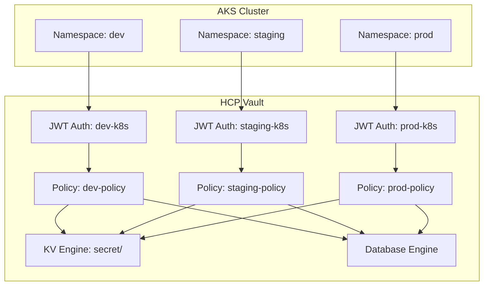

# Multi-Namespace Onboarding Guide

## Overview

This guide provides a comprehensive approach to onboarding multiple teams and applications into your HCP Vault setup using domain-based namespace isolation. Each domain represents a different environment or team boundary with isolated access to secrets and database credentials.

## Architecture Overview



## Domain-Based Namespace Configuration

The Terraform configuration supports three default domains that can be extended:

### Default Domains

1. **Development (`dev`)**
   - Purpose: Development and testing
   - Access: Full CRUD operations on `secret/dev/*`
   - Database: Redis dynamic credentials
   - Policies: Permissive for development needs

2. **Staging (`staging`)**
   - Purpose: Pre-production testing
   - Access: Full CRUD operations on `secret/staging/*`
   - Database: Redis dynamic credentials
   - Policies: Production-like with additional logging

3. **Production (`prod`)**
   - Purpose: Live production workloads
   - Access: Read-only on most paths, controlled writes
   - Database: Redis dynamic credentials with shorter TTL
   - Policies: Strict security policies

## Onboarding Process

### Step 1: Define New Domain

To add a new domain, update the `namespaces` variable in your `terraform.tfvars`:

```hcl
namespaces = {
  "development" = {
    domain      = "dev"
    description = "Development environment namespace"
    policies    = ["dev-policy"]
    kv_paths    = ["secret/dev"]
  }
  "staging" = {
    domain      = "staging"
    description = "Staging environment namespace"
    policies    = ["staging-policy"]
    kv_paths    = ["secret/staging"]
  }
  "production" = {
    domain      = "prod"
    description = "Production environment namespace"
    policies    = ["prod-policy"]
    kv_paths    = ["secret/prod"]
  }
  "team-alpha" = {
    domain      = "alpha"
    description = "Team Alpha dedicated namespace"
    policies    = ["alpha-policy"]
    kv_paths    = ["secret/alpha"]
  }
  "integration" = {
    domain      = "integration"
    description = "Integration testing environment"
    policies    = ["integration-policy"]
    kv_paths    = ["secret/integration"]
  }
}
```

### Step 2: Apply Terraform Configuration

```bash
# Plan the changes
terraform plan -var-file="terraform.tfvars"

# Apply the new configuration
terraform apply -var-file="terraform.tfvars"
```

This creates:
- New JWT auth method: `{domain}-k8s`
- New policy: `{domain}-policy`
- New KV path: `secret/{domain}/*`
- Access to Redis dynamic credentials

### Step 3: Create Kubernetes Namespace

```bash
# Create the namespace in AKS
kubectl create namespace alpha
kubectl create namespace integration

# Label namespaces for better organization
kubectl label namespace alpha domain=alpha environment=development
kubectl label namespace integration domain=integration environment=testing
```

### Step 4: Deploy Vault Secrets Operator Configuration

Create the VSO configuration for each new namespace:

```yaml
# alpha-vault-config.yaml
apiVersion: v1
kind: ServiceAccount
metadata:
  namespace: alpha
  name: vault-secrets-operator
automountServiceAccountToken: true
---
apiVersion: secrets.hashicorp.com/v1beta1
kind: VaultConnection
metadata:
  namespace: alpha
  name: vault-connection
spec:
  address: "https://your-vault-cluster.vault.xxxxx.z1.hashicorp.cloud:8200"
  skipTLSVerify: false
---
apiVersion: secrets.hashicorp.com/v1beta1
kind: VaultAuth
metadata:
  namespace: alpha
  name: vault-auth
spec:
  method: jwt
  mount: alpha-k8s
  jwt:
    role: alpha-role
    serviceAccount: vault-secrets-operator
    audiences:
      - "https://kubernetes.default.svc.cluster.local"
```

### Step 5: Set Up Team-Specific Secrets

Initialize the KV store for the new domain:

```bash
# Set Vault address and token
export VAULT_ADDR="https://your-vault-cluster.vault.xxxxx.z1.hashicorp.cloud:8200"
export VAULT_TOKEN="your-admin-token"

# Create initial secrets for Team Alpha
vault kv put secret/alpha/app-config \
  api_url="https://alpha-api.example.com" \
  debug_level="info" \
  feature_flags="alpha,beta"

vault kv put secret/alpha/database/config \
  host="alpha-db.example.com" \
  port="5432" \
  database="alpha_app" \
  ssl_mode="require"

# Create secrets for Integration environment
vault kv put secret/integration/test-data \
  test_user="integration-tester" \
  test_endpoint="https://integration.example.com" \
  cleanup_enabled="true"
```

## Team Onboarding Checklist

### Pre-Onboarding Requirements

- [ ] **Team Information**
  - Team name and contact information
  - Domain/namespace name (lowercase, no spaces)
  - Environment type (dev/staging/prod/custom)
  - Expected secret types and volume

- [ ] **Technical Requirements**
  - Kubernetes namespace requirements
  - Application service account names
  - Required secret paths and naming conventions
  - Database access requirements

- [ ] **Security Requirements**
  - Access control requirements
  - Audit logging needs
  - Compliance requirements
  - Secret rotation policies

### Onboarding Steps

#### 1. Infrastructure Setup

```bash
# 1. Update Terraform configuration
# Add new domain to terraform.tfvars

# 2. Apply infrastructure changes
terraform plan -var-file="terraform.tfvars"
terraform apply -var-file="terraform.tfvars"

# 3. Create Kubernetes namespace
kubectl create namespace <domain>
kubectl label namespace <domain> domain=<domain> team=<team-name>
```

#### 2. Deploy VSO Configuration

```bash
# Apply VSO resources for the new namespace
envsubst < examples/namespace-template.yaml | kubectl apply -f -
```

#### 3. Initialize Secrets

```bash
# Create initial secret structure
vault kv put secret/<domain>/app-config \
  environment="<domain>" \
  log_level="info"

# Create database configuration if needed
vault kv put secret/<domain>/database/config \
  host="<db-host>" \
  port="5432" \
  database="<db-name>"
```

#### 4. Test Access

```bash
# Deploy test application
kubectl apply -f examples/test-app-<domain>.yaml

# Verify secret retrieval
kubectl logs -n <domain> deployment/test-app
```

### 5. Documentation and Training

Provide the team with:
- [ ] Access credentials and connection information
- [ ] Secret path documentation
- [ ] VSO configuration examples
- [ ] Troubleshooting guide
- [ ] Contact information for support

## Advanced Namespace Patterns

### Environment-Based Isolation

```hcl
# Multiple environments for the same team
namespaces = {
  "team-alpha-dev" = {
    domain      = "alpha-dev"
    description = "Team Alpha development environment"
    policies    = ["alpha-dev-policy"]
    kv_paths    = ["secret/alpha/dev"]
  }
  "team-alpha-prod" = {
    domain      = "alpha-prod"
    description = "Team Alpha production environment"
    policies    = ["alpha-prod-policy"]
    kv_paths    = ["secret/alpha/prod"]
  }
}
```

### Application-Based Isolation

```hcl
# Different applications within the same team
namespaces = {
  "frontend-app" = {
    domain      = "frontend"
    description = "Frontend application namespace"
    policies    = ["frontend-policy"]
    kv_paths    = ["secret/frontend"]
  }
  "backend-api" = {
    domain      = "backend"
    description = "Backend API namespace"
    policies    = ["backend-policy"]
    kv_paths    = ["secret/backend"]
  }
}
```

## Secret Organization Best Practices

### Recommended Path Structure

```
secret/
├── {domain}/
│   ├── app-config/          # Application configuration
│   ├── database/           # Database credentials
│   │   ├── postgres
│   │   ├── mysql
│   │   └── redis
│   ├── external-services/  # External API keys
│   │   ├── payment-gateway
│   │   ├── email-service
│   │   └── monitoring
│   ├── certificates/       # TLS certificates
│   └── features/          # Feature flags
```

### Example Secret Organization

```bash
# Application configuration
vault kv put secret/alpha/app-config \
  log_level="info" \
  cors_origins="https://alpha.example.com" \
  session_timeout="3600"

# Database configurations
vault kv put secret/alpha/database/postgres \
  host="alpha-postgres.example.com" \
  port="5432" \
  database="alpha_app" \
  ssl_mode="require"

# External service credentials
vault kv put secret/alpha/external-services/stripe \
  api_key="sk_test_..." \
  webhook_secret="whsec_..." \
  endpoint="https://api.stripe.com"

# Feature flags
vault kv put secret/alpha/features \
  new_dashboard="true" \
  beta_features="false" \
  maintenance_mode="false"
```

## Monitoring and Auditing

### Set Up Audit Logging

```bash
# Enable audit logging for the new domain
vault audit enable -path="audit-${domain}" file \
  file_path="/vault/audit/audit-${domain}.log" \
  log_raw=false
```

### Monitoring Dashboards

Create team-specific monitoring using the outputs:

```bash
# Get team-specific information
terraform output configured_namespaces
terraform output vault_connection_info
```

## Troubleshooting Common Issues

### Authentication Issues

```bash
# Check JWT configuration
vault read auth/${domain}-k8s/config

# Test JWT token
kubectl create token vault-secrets-operator -n ${domain} --duration=3600s

# Verify role configuration
vault read auth/${domain}-k8s/role/${domain}-role
```

### Policy Issues

```bash
# Check policy content
vault policy read ${domain}-policy

# Test policy with token
vault write auth/${domain}-k8s/login role=${domain}-role jwt=${TOKEN}
```

### Secret Access Issues

```bash
# Check secret existence
vault kv get secret/${domain}/app-config

# Verify path permissions
vault kv list secret/${domain}/
```

## Offboarding Process

When a team or namespace is no longer needed:

### 1. Data Backup

```bash
# Export all secrets for backup
vault kv get -format=json secret/${domain}/ > ${domain}-backup.json
```

### 2. Revoke Access

```bash
# Disable auth method
vault auth disable ${domain}-k8s

# Remove policy
vault policy delete ${domain}-policy
```

### 3. Clean Up Infrastructure

```bash
# Remove from Terraform configuration
# Update terraform.tfvars and apply
terraform plan -var-file="terraform.tfvars"
terraform apply -var-file="terraform.tfvars"
```

### 4. Clean Up Kubernetes

```bash
# Remove namespace
kubectl delete namespace ${domain}
```

## Security Best Practices

1. **Principle of Least Privilege**: Grant minimal required permissions
2. **Regular Access Reviews**: Periodically review and audit access
3. **Secret Rotation**: Implement automated secret rotation
4. **Network Security**: Use private endpoints where possible
5. **Audit Logging**: Enable comprehensive audit logging
6. **Backup and Recovery**: Maintain secure backups of critical secrets

## Support and Escalation

- **Level 1 Support**: Team leads and application owners
- **Level 2 Support**: Platform engineering team
- **Level 3 Support**: Security team and Vault administrators

### Emergency Procedures

1. **Secret Compromise**: Immediately rotate affected secrets
2. **Access Issues**: Check authentication and policy configurations
3. **Service Outage**: Verify Vault cluster health and network connectivity