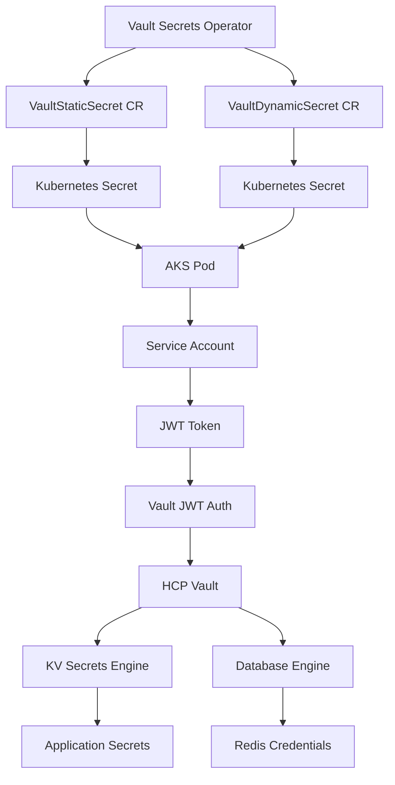

# Vault Secrets Operator Integration Guide

## Overview

This guide explains how to integrate HCP Vault with Azure Kubernetes Service (AKS) using the Vault Secrets Operator (VSO) for seamless secret management without requiring direct network connectivity between AKS and Vault.

## Architecture Overview



## Prerequisites

1. **HCP Vault Cluster**: Deployed using the provided Terraform configuration
2. **AKS Cluster**: Running Kubernetes 1.21+
3. **Vault Secrets Operator**: Installed in your AKS cluster
4. **Service Account**: Configured with proper JWT token

## Step 1: Install Vault Secrets Operator

### Using Helm

```bash
# Add HashiCorp Helm repository
helm repo add hashicorp https://helm.releases.hashicorp.com
helm repo update

# Install Vault Secrets Operator
helm install vault-secrets-operator hashicorp/vault-secrets-operator \
  --namespace vault-secrets-operator-system \
  --create-namespace \
  --values - <<EOF
defaultVaultConnection:
  enabled: true
  address: "https://your-vault-cluster.vault.xxxxx.z1.hashicorp.cloud:8200"
  skipTLSVerify: false
EOF
```

### Using Kubectl

```bash
# Apply the operator directly
kubectl apply -f https://raw.githubusercontent.com/hashicorp/vault-secrets-operator/main/config/crd/bases/secrets.hashicorp.com_vaultauths.yaml
kubectl apply -f https://raw.githubusercontent.com/hashicorp/vault-secrets-operator/main/config/crd/bases/secrets.hashicorp.com_vaultconnections.yaml
kubectl apply -f https://raw.githubusercontent.com/hashicorp/vault-secrets-operator/main/config/crd/bases/secrets.hashicorp.com_vaultdynamicsecrets.yaml
kubectl apply -f https://raw.githubusercontent.com/hashicorp/vault-secrets-operator/main/config/crd/bases/secrets.hashicorp.com_vaultstaticsecrets.yaml
```

## Step 2: Configure Vault Connection

Create a VaultConnection resource for each namespace/domain:

```yaml
# vault-connection-dev.yaml
apiVersion: secrets.hashicorp.com/v1beta1
kind: VaultConnection
metadata:
  namespace: dev
  name: vault-connection
spec:
  address: "https://your-vault-cluster.vault.xxxxx.z1.hashicorp.cloud:8200"
  skipTLSVerify: false
  tlsServerName: "your-vault-cluster.vault.xxxxx.z1.hashicorp.cloud"
```

## Step 3: Configure Vault Authentication

### JWT Authentication Setup

```yaml
# vault-auth-dev.yaml
apiVersion: secrets.hashicorp.com/v1beta1
kind: VaultAuth
metadata:
  namespace: dev
  name: vault-auth
spec:
  method: jwt
  mount: dev-k8s
  jwt:
    role: dev-role
    serviceAccount: vault-secrets-operator
    audiences:
      - "https://kubernetes.default.svc.cluster.local"
```

### Service Account Setup

```yaml
# service-account-dev.yaml
apiVersion: v1
kind: ServiceAccount
metadata:
  namespace: dev
  name: vault-secrets-operator
  annotations:
    azure.workload.identity/client-id: "your-client-id"  # If using Azure Workload Identity
automountServiceAccountToken: true
---
apiVersion: rbac.authorization.k8s.io/v1
kind: ClusterRoleBinding
metadata:
  name: vault-secrets-operator-dev
roleRef:
  apiGroup: rbac.authorization.k8s.io
  kind: ClusterRole
  name: system:auth-delegator
subjects:
- kind: ServiceAccount
  name: vault-secrets-operator
  namespace: dev
```

## Step 4: Retrieve Static Secrets from KV Engine

### Basic KV Secret Retrieval

```yaml
# vault-static-secret-dev.yaml
apiVersion: secrets.hashicorp.com/v1beta1
kind: VaultStaticSecret
metadata:
  namespace: dev
  name: app-config
spec:
  type: kv-v2
  mount: secret
  path: dev/app-config
  destination:
    name: app-config-secret
    create: true
  refreshAfter: 30s
  vaultAuthRef: vault-auth
```

### Application-Specific Secrets

```yaml
# vault-static-secret-database.yaml
apiVersion: secrets.hashicorp.com/v1beta1
kind: VaultStaticSecret
metadata:
  namespace: dev
  name: database-config
spec:
  type: kv-v2
  mount: secret
  path: dev/database/postgres
  destination:
    name: database-credentials
    create: true
    transformation:
      excludes:
      - "internal_*"
      includes:
      - "username"
      - "password"
      - "host"
      - "port"
      templates:
        connection_string: |
          postgresql://{{ .Secrets.username }}:{{ .Secrets.password }}@{{ .Secrets.host }}:{{ .Secrets.port }}/{{ .Secrets.database }}
  refreshAfter: 60s
  vaultAuthRef: vault-auth
```

## Step 5: Retrieve Dynamic Secrets from Database Engine

### Redis Dynamic Credentials

```yaml
# vault-dynamic-secret-redis.yaml
apiVersion: secrets.hashicorp.com/v1beta1
kind: VaultDynamicSecret
metadata:
  namespace: dev
  name: redis-credentials
spec:
  mount: database
  path: creds/redis-role
  destination:
    name: redis-dynamic-credentials
    create: true
    transformation:
      templates:
        redis_url: |
          redis://{{ .Secrets.username }}:{{ .Secrets.password }}@redis-host:6379
  refreshAfter: 300s  # Refresh every 5 minutes
  renewalPercent: 67  # Renew when 67% of TTL has passed
  vaultAuthRef: vault-auth
```

## Step 6: Using Secrets in Pods

### Pod with Static Secrets

```yaml
# app-deployment.yaml
apiVersion: apps/v1
kind: Deployment
metadata:
  namespace: dev
  name: my-app
spec:
  replicas: 3
  selector:
    matchLabels:
      app: my-app
  template:
    metadata:
      labels:
        app: my-app
    spec:
      serviceAccountName: vault-secrets-operator
      containers:
      - name: app
        image: my-app:latest
        env:
        - name: DATABASE_URL
          valueFrom:
            secretKeyRef:
              name: database-credentials
              key: connection_string
        - name: REDIS_URL
          valueFrom:
            secretKeyRef:
              name: redis-dynamic-credentials
              key: redis_url
        envFrom:
        - secretRef:
            name: app-config-secret
        ports:
        - containerPort: 8080
```

### Pod with Volume-Mounted Secrets

```yaml
# app-with-volumes.yaml
apiVersion: apps/v1
kind: Deployment
metadata:
  namespace: dev
  name: my-app-volumes
spec:
  replicas: 1
  selector:
    matchLabels:
      app: my-app-volumes
  template:
    metadata:
      labels:
        app: my-app-volumes
    spec:
      serviceAccountName: vault-secrets-operator
      containers:
      - name: app
        image: my-app:latest
        volumeMounts:
        - name: app-secrets
          mountPath: /etc/secrets/app
          readOnly: true
        - name: db-secrets
          mountPath: /etc/secrets/db
          readOnly: true
      volumes:
      - name: app-secrets
        secret:
          secretName: app-config-secret
      - name: db-secrets
        secret:
          secretName: database-credentials
```

## Step 7: Secret Rotation and Lifecycle Management

### Automatic Secret Rotation

The Vault Secrets Operator automatically handles secret rotation based on the configuration:

- **Static Secrets**: Refreshed based on `refreshAfter` interval
- **Dynamic Secrets**: Automatically renewed based on `renewalPercent`

### Manual Secret Refresh

Force refresh of secrets by annotating the resource:

```bash
kubectl annotate vaultstaticsecret app-config \
  secrets.hashicorp.com/secret-refresh=$(date +%s) \
  -n dev
```

## Step 8: Monitoring and Troubleshooting

### Check VSO Status

```bash
# Check operator pods
kubectl get pods -n vault-secrets-operator-system

# Check VSO logs
kubectl logs -n vault-secrets-operator-system deployment/vault-secrets-operator

# Check secret status
kubectl describe vaultstaticsecret app-config -n dev
kubectl describe vaultdynamicsecret redis-credentials -n dev
```

### Common Issues and Solutions

1. **Authentication Failures**
   ```bash
   # Check service account token
   kubectl get serviceaccount vault-secrets-operator -n dev -o yaml
   
   # Verify JWT token
   kubectl create token vault-secrets-operator -n dev --duration=3600s
   ```

2. **Connection Issues**
   ```bash
   # Test connectivity to Vault
   kubectl run test-vault --rm -i --tty --image=curlimages/curl -- \
     curl -k https://your-vault-cluster.vault.xxxxx.z1.hashicorp.cloud:8200/v1/sys/health
   ```

3. **Policy Issues**
   ```bash
   # Check Vault policies
   vault policy read dev-policy
   vault auth list
   vault read auth/dev-k8s/role/dev-role
   ```

## Best Practices

1. **Secret Naming**: Use consistent naming conventions for secrets
2. **Namespace Isolation**: Keep secrets isolated by namespace
3. **Rotation Frequency**: Balance between security and performance
4. **Monitoring**: Set up alerts for secret refresh failures
5. **Testing**: Always test secret rotation in non-production environments
6. **Backup**: Ensure Vault data is properly backed up

## Security Considerations

1. **Network Security**: Use private endpoints when possible
2. **RBAC**: Implement proper Kubernetes RBAC
3. **Service Accounts**: Use dedicated service accounts per application
4. **Audit Logging**: Enable audit logging in both Vault and Kubernetes
5. **Secret Encryption**: Ensure secrets are encrypted at rest in etcd

## Example Application Integration

See the `examples/` directory for complete application examples showing:
- Database connection with dynamic credentials
- Redis integration with automatic credential rotation
- Multi-container applications with shared secrets
- Init containers for secret validation